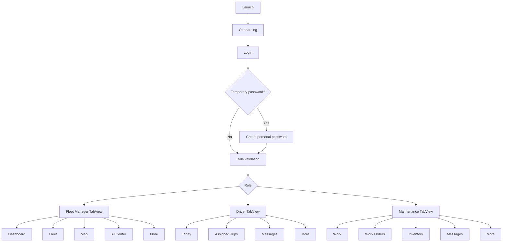

# FleetCare FMS Production Blueprint

This blueprint is the required pre-code product and engineering plan for the Fleet Management System iOS app. It follows the supplied SRS as the source of truth: SwiftUI only, MVVM, SwiftData persistence, Swift Concurrency, MapKit routing, light mode only, no Face ID, no passkeys, no OTP, no social login, and Fleet Manager as the central authority for assignments and approvals.

## Step 1: Information Architecture

### Global Entry

Launch -> Onboarding -> Login -> First-login activation when required -> Role validation -> Role dashboard.

The login surface accepts only email and password. Temporary passwords move the user into the activation flow where they create and confirm a personal password. Subsequent login validates role and routes the user to the authorized shell. Logout clears session state and returns to Login.

### Fleet Manager

Dashboard, User Management, Vehicle Management, Trip Management, Maintenance Scheduling, Compliance Monitoring, Reports, Communication, Notifications, and AI Intelligence Center.

The Fleet Manager is the operational authority. Drivers, vehicles, trips, maintenance personnel, work orders, purchase requests, AI alerts, compliance actions, and reports all flow through manager review or assignment.

### Driver

Dashboard, Assigned Trips, Pre-Trip Inspection, Defect Reporting, Active Trip Execution, Route Navigation, Post-Trip Inspection, Notifications, and Communication.

Driver screens never expose user management, vehicle management, trip creation, work order creation, fleet analytics, or AI intelligence.

### Maintenance Personnel

Dashboard, Assigned Work Orders, Vehicle Inspection, Repairs, Repair Evidence, Quality Inspection, Inventory, Purchase Requests, Maintenance History, Notifications, and Communication.

Maintenance screens never expose user management, trip creation, fleet analytics, or manager approval actions.

## Step 2: Complete Navigation Architecture



Each role uses a stable `TabView` for high-frequency destinations and `NavigationStack` for detail flows. Sequential safety workflows, such as inspections and active trip execution, use modal presentation only when the user must complete or explicitly cancel the task.

## Step 3: Role-Based Dashboard Architecture

### Fleet Manager Dashboard

Purpose: show whether the fleet is safe, staffed, assigned, compliant, and on schedule.

Primary modules: fleet status KPIs, pending approvals, open defects, active trips, upcoming maintenance, compliance exceptions, priority AI alerts, unread operational messages, and current notifications.

Primary actions: create user, create trip, assign driver, assign vehicle, review defect report, create work order, approve purchase request, review AI alert, and open report.

### Driver Dashboard

Purpose: make the next assigned trip and required safety action unmistakable.

Primary modules: next trip, assigned vehicle, route summary, inspection status, defect report action, active trip action, post-trip inspection prompt, notifications, and messages.

Primary actions: start pre-trip inspection, report defect, start trip when vehicle is cleared, preview route, complete trip, complete post-trip inspection, and message manager or maintenance.

### Maintenance Dashboard

Purpose: rank assigned work and move repairs through evidence-backed completion.

Primary modules: assigned work orders, urgent repairs, parts availability, purchase request status, quality inspection queue, maintenance history shortcuts, notifications, and messages.

Primary actions: inspect vehicle, perform repair, upload evidence, perform quality inspection, check inventory, create purchase request, and close work order when QA passes.

## Step 4: Database Entity Relationships

SwiftData is the local persistence layer. Server authorization remains authoritative; client-side RBAC controls visibility and task flow.

Core entities:

- `FleetUser`: email, role, activation status, manager-created temporary password state.
- `Vehicle`: registration, make, model, year, odometer, status, assigned driver, compliance documents.
- `FleetTrip`: origin, destination, schedule, assigned driver, assigned vehicle, route, status, inspections, fuel logs.
- `Inspection`: trip, vehicle, type, checklist items, pass/fail result, photos, submitted by.
- `DefectReport`: vehicle, driver, severity, description, evidence, manager review status, linked work order.
- `WorkOrder`: vehicle, manager creator, assigned technician, priority, due date, status, tasks, evidence, QA result.
- `MaintenanceTask`: work order step, completion state, notes, parts used.
- `MaintenanceHistory`: vehicle, work order, technician, completed repairs, cost, completed date.
- `InventoryItem`: part, quantity, threshold, reserved quantity, location, forecast state.
- `PurchaseRequest`: requested part, quantity, technician requester, manager approval, supplier, status.
- `FuelLog`: vehicle, trip, quantity, cost, odometer, efficiency.
- `FleetMessage`: conversation, sender, recipient role, body, read status, contextual entity link.
- `FleetNotification`: recipient, trigger type, title, body, read state, linked entity.
- `ComplianceDocument`: vehicle, document type, expiry date, status, renewal reminder.
- `AIAlert`: manager-visible insight, type, score, confidence, recommendation, review state.

Relationship rules: Fleet Manager creates users, trips, work orders, assignments, and approvals. Drivers create inspections and defect reports. Maintenance personnel update work orders, inventory, purchase requests, repair evidence, and history. Notifications are generated from trip assignment, work order assignment, defects, inventory alerts, compliance alerts, AI alerts, purchase requests, and messages.

## Step 5: MVVM Folder Structure

```text
FleetCare/
  App/                     App entry, root routing, session state
  DesignSystem/            Colors, spacing, typography, reusable modifiers
  Components/              Cards, badges, empty/error/offline states, rows
  Models/                  SwiftData entities and sample seed data
  Services/                Auth, notification, routing, AI, OCR, sync protocols
  Repositories/            SwiftData and remote data access
  Features/
    Authentication/        Login, activation, logout
    Manager/               Dashboard, users, vehicles, trips, approvals, AI
    Driver/                Trips, inspections, navigation, defects
    Maintenance/           Work orders, inventory, repairs, purchases
    Shared/                Communication, notifications, account
  Resources/               Assets and localization
```

Views render state and send user intents. `@Observable @MainActor` view models own feature state, validation, and async loading. Services expose protocol-based async APIs. Repositories hide SwiftData queries and synchronization details. Long-running sync, AI scoring, routing, and OCR tasks use Swift Concurrency with cancellation.

## Step 6: Component Library

- `MetricCard`: role dashboard metrics with value, label, detail, and semantic symbol.
- `StatusBadge`: text plus symbol plus status color; never color-only.
- `SectionHeader`: consistent section hierarchy and optional trailing action.
- `VehicleRow`: vehicle identity, registration, status, and assignment summary.
- `TripRow`: trip title, route, schedule, and status.
- `WorkOrderCard`: task, vehicle, priority, due date, and status.
- `InsightCard`: AI or rule-based recommendation, score, explanation, and manager action.
- `InventoryRow`: part name, quantity, threshold, stock state, and restock action.
- `ConversationRow`: participant, latest message, time, and read state.
- `NotificationRow`: trigger, title, linked entity, time, and read state.
- `InspectionChecklist`: grouped checklist rows with large touch targets.
- `EvidencePicker`: camera/photo upload entry point for defects and repairs.
- `EmptyStateView`, `OfflineBanner`, and future loading/error states for shared resilience.

## Step 7: Complete Screen Hierarchy

### Authentication

Login -> First Login Activation -> Role-specific dashboard. Account -> Sign Out -> Login.

### Fleet Manager

Dashboard -> KPI detail, approval detail, defect review, AI alert detail, trip detail.

Fleet -> Vehicle list -> Vehicle detail -> assignment, compliance documents, maintenance history, trip history.

Map -> live fleet map -> vehicle sheet -> trip route, vehicle detail, incident detail.

AI Center -> predictive maintenance, fuel optimization, inventory forecasting, work order prioritization, intelligent routing review.

More -> users, trips, maintenance scheduling, compliance, reports, communication, notifications, account.

### Driver

Today -> assigned trip -> pre-trip inspection -> start trip -> route navigation -> complete trip -> post-trip inspection -> trip summary.

Trips -> trip detail -> route, delay report, defect report.

Messages -> conversation list -> message detail.

More -> defect reporting, post-trip inspection, notifications, account.

### Maintenance

Work -> work order detail -> inspect -> parts check -> repair -> evidence -> quality inspection -> close order or repeat repair.

Inventory -> item detail -> purchase request -> manager approval status.

Messages -> conversation list -> message detail.

More -> maintenance history, vehicle inspection, repair evidence, purchase requests, notifications, account.

## Step 8: Detailed Wireframes

### Login

Large title, short trust copy, email field, password field, primary Sign In button. Temporary password success transitions to activation. Inline validation explains invalid email, missing password, mismatched activation passwords, or unauthorized role.

### Fleet Manager Dashboard

Large title, horizontal KPI row, pending approvals block, priority AI alert card, today operations list, notification/message affordances in toolbar. The most urgent action is visible without scrolling on standard iPhone sizes.

### Driver Trip Flow

Trip card with route, vehicle, start time, and inspection status. Primary button starts pre-trip inspection. Failed checklist item opens defect form. Cleared inspection unlocks Start Trip. Active trip shows MapKit route, destination, ETA, delay report, and emergency action. Completion requires post-trip inspection and summary.

### Maintenance Work Order Flow

Header shows priority, vehicle, due time, and safety state. Step list follows SRS order: receive work order, inspect vehicle, identify parts, check inventory, purchase request if needed, repair, upload evidence, quality inspection, close or repeat.

### AI Center

Manager-only grouped insight list. Each insight shows type, affected vehicle or fleet scope, score, confidence, recommendation, data inputs, freshness, and review action. Work order priority uses rule-based scoring and is labeled as such.

## Step 9: SwiftUI View Structure

Use SwiftUI native controls: `NavigationStack`, `TabView`, `List`, `Form`, `Button`, `Picker`, `Toggle`, `Map`, `Chart`, and `ContentUnavailableView`. Use SF Symbols for actions and status. Use `MapKit` for maps and Apple navigation handoff; do not build custom ML routing.

OCR screens use Vision only when reading documents, meter readings, plates, or repair evidence text is required. Core ML is justified only for predictive maintenance, fuel optimization, and inventory forecasting. Work order prioritization remains rule-based.

Light mode is enforced at the root with `.preferredColorScheme(.light)`. Asset colors use the SRS palette: primary `#0A2540`, secondary `#00B4D8`, background `#F8FAFC`, card `#FFFFFF`, text primary `#0A2540`, text secondary `#64748B`, success `#22C55E`, warning `#F59E0B`, and error `#EF4444`.

## Step 10: State Management

App state: onboarding completion, authenticated session, active user, active role, offline state.

Authentication state: email, password, temporary password status, activation password, confirmation, validation errors.

Feature state: loading, empty, error, query, filters, selected entity, draft edits, submission state.

Persistence state: SwiftData model context, local records, queued writes, sync metadata, conflict markers.

Concurrency: View models call async services inside cancellation-aware `Task`s. Mutations use idempotent commands. Offline writes queue with visible sync state. AI computations and OCR run off the main actor and return reviewed outputs to the UI.

## Step 11: Accessibility Strategy

Support VoiceOver, Dynamic Type, large touch targets, high contrast, and Switch Control. Icon-only buttons have labels. Buttons that start safety-critical or destructive actions have clear text and confirmation where needed. Charts expose accessible descriptors. Map data has list equivalents. Status always includes text and symbols. Checklist rows are at least 44 points tall and expose checked/not checked values. Error messages are adjacent to the field or action they explain.

## Step 12: Apple HIG Compliance Review

The app uses native hierarchy, platform typography, SF Symbols, standard navigation, standard form controls, and clear primary actions. It avoids flashy custom UI, dark mode, social sign-in, biometric login, OTP, and unapproved workflow shortcuts. It uses progressive disclosure for enterprise complexity, keeps role dashboards focused, asks for camera/location permissions in context, and preserves user input during errors.

## Step 13: Implementation Plan

1. Finalize SwiftData entities and relationships for all SRS records.
2. Replace sample authentication with manager-created users, temporary password activation, and role validation.
3. Build Fleet Manager workflows first because they control assignments and approvals.
4. Build Driver assigned-trip, inspection, defect, navigation, and summary workflows.
5. Build Maintenance work order, repair evidence, QA, inventory, and purchase request workflows.
6. Add shared notification engine and role-filtered in-app notification screens.
7. Add shared communication module with conversations, search, read status, and contextual links.
8. Add manager-only AI Intelligence Center with model-backed predictive maintenance, fuel optimization, inventory forecasting, rule-based work order prioritization, and MapKit routing review.
9. Add compliance monitoring and reports.
10. Add Vision OCR only to targeted evidence/document capture flows.
11. Complete offline queue, conflict handling, migration tests, and role authorization tests.
12. Audit accessibility with VoiceOver, Dynamic Type, Increase Contrast, and large touch targets.
13. Run HIG, privacy, performance, and production-readiness review before release.
