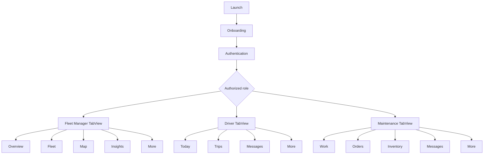

# FleetCare Product and Engineering Blueprint

## 1. Product promise

FleetCare gives every fleet role a focused, trustworthy workspace. Managers understand fleet health and intervene early. Drivers complete trips safely with minimal distraction. Technicians move work orders from diagnosis to verified repair with little typing. The interface favors progressive disclosure, semantic system behavior, and concise recommendations over dense enterprise dashboards.

## 2. Information architecture

### Shared foundation

Splash → onboarding → sign in → account activation / passkey / Face ID / password → OTP verification → password recovery → role-authorized app shell.

Shared destinations: account, security, notifications, offline sync status, conversations, search, help, privacy, and sign out.

### Fleet Manager

- Overview: operating KPIs, utilization trend, priority alerts, current trips.
- Fleet: vehicle search, status filters, vehicle profile, assignment, documents, trip and maintenance history.
- Map: live vehicle markers, route status, geofences, traffic, vehicle sheet, replay.
- Insights: predictive maintenance, driver behavior, fuel optimization, inventory forecast.
- More: users, trips, maintenance, fuel, geofences, reports, messages, account.

### Driver

- Today: next assignment, required inspection, route summary, safety actions.
- Trips: assigned, active, completed, trip detail, navigation, delay/issue report.
- Messages: operations and maintenance conversations.
- More: pre/post-trip inspection, defect report, voice logging, emergency, summaries, account.

### Maintenance

- Work: daily workload, next priority, parts watch.
- Orders: assigned work, details, repair workflow, evidence, parts/labor, QA.
- Inventory: stock, low-stock forecast, part detail, purchase requests.
- Messages: manager/driver communication.
- More: inspections, evidence, quality, history, purchasing, account.

## 3. Navigation map



Tabs contain top-level, frequently used destinations. `NavigationStack` handles drill-down. Sheets contain short reversible tasks such as filtering, quick creation, or password recovery. Full-screen covers are reserved for safety-critical, sequential workflows such as inspection and active navigation.

## 4. Core user flows

### Manager handles a predicted vehicle risk

Overview priority card → insight detail → evidence and confidence → affected vehicle → maintenance history → create/schedule work order → assign technician → monitor completion.

### Driver completes a trip

Today → pre-trip inspection → defect-free confirmation → start trip → distraction-reduced route view → optional voice log / delay report → arrive → post-trip inspection → trip summary.

### Technician completes a repair

Work → highest-priority order → confirm symptom → capture before photo → repair and record parts/labor → capture after photo → quality checklist → complete → offline queue syncs if needed.

### Manager creates a geofence

Map → geofence tools → draw/resize boundary → name and assign vehicles → choose enter/exit rules → review recipients → save → monitor alerts.

## 5. Screen specification

Every production screen uses the same state contract:

- Loading: skeletons preserve final geometry and announce “Loading” once to VoiceOver.
- Empty: explains why the area is empty and offers one primary recovery action.
- Error: plain-language cause, retained user input, retry, and support path for repeated failure.
- Offline: persistent compact banner; mutating actions are queued and display sync state.
- Dark mode: semantic backgrounds/materials; chart and status differentiation never relies on color alone.
- Accessibility: Dynamic Type without clipped fixed heights, meaningful reading order, 44x44 minimum targets, labels/hints/values for non-text controls, reduced-motion fallback.

### Authentication

Purpose: establish trust before requesting credentials. Hierarchy: product identity → credential fields → primary sign-in → passkey/Apple/Face ID → recovery. Password errors appear inline and do not erase input. OTP uses one semantic field with system autofill rather than six inaccessible boxes. Activation explains organization and role before confirmation.

### Manager overview

Purpose: answer “Is the fleet operating safely and on plan?” Hierarchy: greeting → horizontally scrollable KPIs → weekly utilization chart → highest-impact insight → today’s operations. Only exceptions use warning/error colors. Metric cards are summaries, not decorative tiles.

### Fleet and vehicle detail

Purpose: find a vehicle quickly and understand its operational record. Search accepts name, plate, VIN, and driver. Filters use a sheet when the set grows. Detail uses an identity header followed by status, assignment, specifications, documents, current trip, maintenance, fuel, and audit history.

### Trip management and trip detail

Purpose: plan, dispatch, and monitor work. Lists group active, upcoming, and completed trips. Detail presents route, timing, vehicle/driver, stops, load notes, live events, and actions. Destructive cancellation requires confirmation and a reason.

### Maintenance management

Purpose: prevent avoidable downtime. Calendar and due-soon views coexist with risk-ranked recommendations. Recommendations always show confidence, contributing signals, freshness, and a human review action.

### Fuel management

Purpose: reveal consumption and anomalies without spreadsheet density. Summary cards show spend, efficiency, idle consumption, and exceptions; trend and comparison charts lead to vehicle-level transactions.

### Geofences

Purpose: create spatial rules with a native map interaction. Map remains primary; a bottom sheet contains selected boundary details. Drawing has undo and explicit review. Alerts state vehicle, event, boundary, time, and map context.

### Reports

Purpose: answer operational questions. Report landing groups Fleet, Fuel, Maintenance, and Driver reports. Each report starts with a time range and summary, followed by trends, notable changes, and share/export. Large data sets use drill-down and pagination rather than a tiny table.

### AI insights

Purpose: prioritize evidence-based action. Each card includes outcome, affected scope, score, confidence, data freshness, explanation, and recommended next step. Language avoids certainty when the model is probabilistic. Users can dismiss, defer, or provide feedback.

### Driver today and active trip

Purpose: keep required action obvious and distraction low. Before driving, the primary inspection/start action occupies the thumb-reachable lower region. While moving, the interface suppresses noncritical controls, favors spoken guidance, and requires stopping for complex input. Emergency remains distinct, labeled, and guarded against accidental activation.

### Inspections and defect reporting

Purpose: produce consistent safety evidence. Checklist rows are large and grouped by physical walk-around order. A failed item opens severity, photo, optional voice note, and “vehicle safe to operate?” decision. Submission confirms who will be notified.

### Maintenance work order

Purpose: make progress unmistakable. Header shows vehicle, priority, due time, and safety status. A five-step workflow covers symptom, evidence, repair, parts/labor, and QA. Photo-first actions precede notes. Offline completion remains visibly pending until server acknowledgment.

### Inventory and purchasing

Purpose: prevent stockouts. Parts show quantity, minimum, reserved stock, location, and forecast. Low stock is conveyed by label and symbol as well as color. Purchase requests reuse forecast context and require supplier/approval data only when policy demands it.

### Communication

Purpose: keep operational conversations attached to context. Conversation list shows role, latest message, time, and unread state. Chat supports photos and links to vehicle/trip/order records. Safety or work-order events generate structured cards instead of ambiguous free text.

## 6. Design system

### Color

- Brand primary: Deep Navy `#0F4C81` in the asset catalog with a brighter dark-mode variant.
- Brand secondary: Steel Blue `#4A90A4` with a dark-mode variant.
- Success, warning, and error use system semantic green, orange, and red.
- App background: `#F7F8FA` in light mode and system-equivalent black in dark mode.
- Surfaces use semantic secondary background and materials. Text uses primary/secondary/tertiary semantic styles.

Color is never the only status signal: badges include text and symbols. High-contrast testing must maintain a minimum 4.5:1 ratio for normal text.

### Typography

Use system text styles, which resolve to SF Pro and respond to Dynamic Type:

- `.largeTitle.bold()` page identity and key task.
- `.title` / `.title2` detail identity and high-value metrics.
- `.title3.bold()` section headings.
- `.headline` card/list identity.
- `.body` primary content.
- `.subheadline` supporting content and actions.
- `.caption` metadata only.

Do not scale text with manual point sizes except large decorative symbols. Layout must remain functional through accessibility sizes.

### Spacing and shape

Base rhythm: 4, 8, 12, 16, 24, 32 points. Standard card radius: 18. Control radius: 12. Use shadows only when needed to distinguish an overlay from map content; grouped surfaces otherwise rely on fill and spacing.

### Motion

Use `.smooth` or spring animation for state continuity, numeric content transitions for KPI changes, symbol effects for quiet affordance, and matched geometry only when an object visibly persists between list and detail. Respect Reduce Motion by replacing spatial movement with opacity/content changes. Never animate safety alerts repeatedly.

## 7. Component library

- `MetricCard`: value, label, trend/context, semantic symbol.
- `StatusBadge`: symbol + status text + semantic color.
- `InsightCard`: recommendation, score, confidence progress, action.
- `VehicleRow/Card`: identity, plate, assignment/status.
- `TripRow/Card`: route, schedule, status.
- `WorkOrderCard`: task, vehicle, priority, due status.
- Inventory row/card: stock, threshold, forecast.
- Chart widget: title, period, summary, accessible descriptor.
- Map vehicle annotation and selected-vehicle bottom sheet.
- Filter sheet with applied-filter count and reset.
- Search field using native searchable behavior.
- Skeleton, empty, error, offline, and sync-pending states.
- Photo evidence picker, voice note recorder, confirmation sheet.

## 8. Architecture and state strategy

```text
FleetCare/
  App/                 app composition, session, routing
  AppIntents/          Siri and Shortcuts entry points
  Components/          reusable visual and state components
  DesignSystem/        semantic tokens and modifiers
  Features/
    Authentication/
    Manager/
    Driver/
    Maintenance/
    Shared/
  Models/              SwiftData domain entities and DTO mapping
  Resources/           asset catalog and localization
```

Production MVVM adds one `@Observable @MainActor` view model per independently testable feature. Views render immutable state and send intents. View models call protocol-based services using async/await. Repositories map remote DTOs to SwiftData entities. Actors isolate sync queues, telemetry streams, image processing, and token refresh.

Recommended state layers:

- App state: authentication, authorization, organization, connectivity.
- Feature state: query, filters, loading/error, selected entity, edit draft.
- Durable local state: vehicles, trips, orders, messages, inventory, sync operations.
- Ephemeral view state: sheet visibility, focus, scroll position.
- Server state: versioned records and cursor-based collections.

Do not place networking or persistence in views. Use cancellation-aware tasks and typed errors. Apply optimistic updates only when reversal is clear. All queued writes need idempotency keys and conflict policy.

## 9. Security and privacy

- Passkeys via AuthenticationServices; Face ID gates locally cached sensitive content.
- OAuth/OIDC access tokens live in Keychain, never UserDefaults or SwiftData.
- Role and organization authorization is enforced on the server; client gating is only UX.
- TLS with standard platform trust; certificate pinning only with an operational rotation plan.
- Encrypt sensitive cached fields and files using Data Protection.
- Strip photo location metadata unless explicitly required.
- Audit account, vehicle, trip, order, inventory, and report mutations.
- Support retention/export/deletion policy for GDPR and regional requirements.
- Redact telemetry and crash logs; never log tokens, VIN-linked personal data, or message bodies.

## 10. Accessibility acceptance criteria

- All workflows complete with VoiceOver and Switch Control.
- Reading order matches visual hierarchy.
- Every icon-only button has an explicit label; ambiguous actions have hints.
- Charts expose title, summary, axes, and values through `AXChartDescriptor`.
- Dynamic Type through AX5 has no clipping, overlap, or lost actions.
- Differentiate status with text/symbol/shape, not color alone.
- Reduce Motion removes nonessential spatial effects.
- Bold Text, Increase Contrast, Button Shapes, and Reduce Transparency remain legible.
- Maps have equivalent list-based vehicle and geofence access.
- Audio/voice features have text alternatives and visible recording state.

## 11. Dark mode

Use asset and system semantic colors rather than runtime RGB values. Materials should not sit on visually noisy imagery without a contrast scrim. Chart series use luminance-separated colors, symbols, and line styles. Map overlays use system-aware fills and strokes. Photos retain natural color; evidence annotations use a semantic high-contrast backing.

## 12. HIG compliance checklist

- Native navigation, search, menus, sheets, lists, maps, charts, and authentication controls.
- One clear primary action per task.
- Tabs are stable destinations, not transient actions.
- Destructive actions are labeled and confirmed where consequences are difficult to reverse.
- Touch targets are at least 44x44 points.
- System typography and Dynamic Type are used.
- Semantic color and materials support appearance/accessibility changes.
- Permissions are requested in context with a clear purpose.
- Empty/error/offline states explain recovery.
- Progress is determinate whenever total work is known.
- Role permissions reduce unavailable choices rather than presenting repeated denial alerts.
- iPad layouts should adopt `NavigationSplitView` for fleet/map and list/detail workflows in the production expansion.

## 13. Production roadmap

1. Replace sample repositories with authenticated API, WebSocket telemetry, and background sync.
2. Add NavigationSplitView adaptations, route planner, geofence editor, and trip replay.
3. Integrate passkey registration/activation, Keychain tokens, OTP, and LocalAuthentication.
4. Add camera/Vision inspection assistance with explicit human confirmation.
5. Add Core ML model packages, model cards, drift monitoring, confidence calibration, and feedback.
6. Add push notifications, Live Activities for active trips, widgets, and richer App Intents.
7. Add unit, snapshot, accessibility, UI, offline conflict, migration, and performance tests.
8. Profile cold launch, scrolling, maps, image memory, SwiftData queries, and long-running telemetry with Instruments.
9. Complete privacy nutrition labels, threat model, penetration test, retention controls, and operational runbooks.

## 14. Definition of done

Production release requires zero compiler warnings, zero Auto Layout/runtime constraint warnings, no known memory leaks, tested migration and rollback, observable sync health, audited accessibility flows, privacy review, and measured performance budgets on the oldest supported device.
